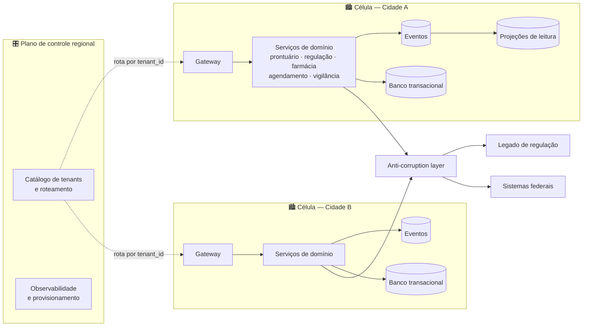

<div align="center">

# 🏥 Plataforma Saúde D

### Arquitetura multi-tenant para redes municipais de atenção à saúde

**Grupo 04 · Caso Saúde · Envelope D**
Padrões e Arquitetura de Software — PUC-Campinas · 2026/2
Trabalho *Um problema, cinco realidades*

[](https://github.com/EnricoGazal/Grupo-04-rede-municipal-saude/actions/workflows/spike.yml)


</div>

---

## 📌 Sobre o projeto

Uma empresa vende um sistema de atenção à saúde para **várias secretarias municipais**, com redes de **10 a 200 unidades**, rodando em **nuvem pública multirregião**. O desafio é projetar uma arquitetura em que:

- 🚑 a **UPA continua triando sem internet**;
- 🛏️ **duas unidades nunca reservam o mesmo leito**;
- 🔒 o **prontuário** é rastreável por 20 anos e convive com a LGPD;
- 📣 a **notificação compulsória** chega à vigilância em até 24 h, mesmo com o sistema federal fora do ar;
- 🔁 o **legado de regulação** é substituído aos poucos;
- 🏙️ um **pico de campanha ou falha em uma cidade não derruba as outras**.

## 🧩 Composição escolhida

| Estilo | Papel na solução |
|---|---|
| **Arquitetura celular** | Fronteira operacional — uma célula isolada por cidade |
| **Microsserviços** | Fronteiras de domínio dentro de cada célula |
| **Hexagonal** | Fronteira de código entre domínio e infraestrutura |
| **Orientada a eventos** | Desacoplamento quando a resposta não precisa ser imediata |
| **CQRS seletivo** | Só em consultas com pico ou agregações caras |

> ❌ **Descartados:** Event Sourcing como arquitetura de dados geral e ESB como núcleo da aplicação — justificativa na [Entrega 1](entrega-1-matriz-de-estilos/#estilos-considerados-e-descartados).



*Dados clínicos nunca atravessam o plano de controle: se ele cair, as células já provisionadas continuam operando.*

## 📦 Entregas

| # | Entrega | Status | Link |
|:-:|---|:-:|---|
| 1 | Matriz de estilos aplicada (12 estilos) | ✅ | [📁 entrega-1-matriz-de-estilos](entrega-1-matriz-de-estilos/) |
| 2 | Documento de arquitetura — C4, mapa de restrições, ADRs | ✅ | [📁 entrega-2-documento-de-arquitetura](entrega-2-documento-de-arquitetura/) |
| 3 | Spike — isolamento por célula (ADR-0005) | ✅ | [📁 entrega-3-spike](entrega-3-spike/) |
| 4 | Leitura cruzada com outro grupo | ⏳ | [📁 entrega-4-leitura-cruzada](entrega-4-leitura-cruzada/) |
| 5 | Entrega final revisada | ⏳ | [📁 entrega-5-entrega-final](entrega-5-entrega-final/) |

## 🧪 Spike: isolamento por célula

O spike prova a decisão mais arriscada: **a falha de uma cidade não afeta as outras**. Duas células com filas e consumidores independentes; a Cidade A recebe um pico e falha, e a Cidade B continua processando normalmente.

```bash
cd entrega-3-spike
python3 exemplo.py | diff - saida-esperada.txt && echo "OK: saída idêntica"
```

<details>
<summary>Saída esperada</summary>

```text
SPIKE ADR-0005 — isolamento por célula
eventos roteados: 18
erros de rota: ()
cidade-a estado final: (6, 6, 0, True)
cidade-b estado final: (1, 5, 0, False)
cidade-a pendente na falha: 6
cidade-b processados: ('B-001', 'B-002', 'B-003', 'B-late-001', 'B-late-002')
isolamento comprovado: True
```

</details>

A cada push, o GitHub Actions roda o spike com Python 3.12 e compara com `saida-esperada.txt` (badge no topo).

## 🗂️ Estrutura do repositório

```text
.
├── README.md
├── entrega-1-matriz-de-estilos/
│   └── README.md
├── entrega-2-documento-de-arquitetura/
│   └── README.md
├── entrega-3-spike/
│   ├── README.md
│   ├── exemplo.py
│   └── saida-esperada.txt
├── entrega-4-leitura-cruzada/
│   └── README.md
├── entrega-5-entrega-final/
│   └── README.md
└── .github/workflows/spike.yml
```

## 📚 Referências

1. Enunciado *Um problema, cinco realidades* — Padrões e Arquitetura de Software, PUC-Campinas.
2. *Estilos Arquiteturais de Software: guia de consulta* — livro da disciplina.
