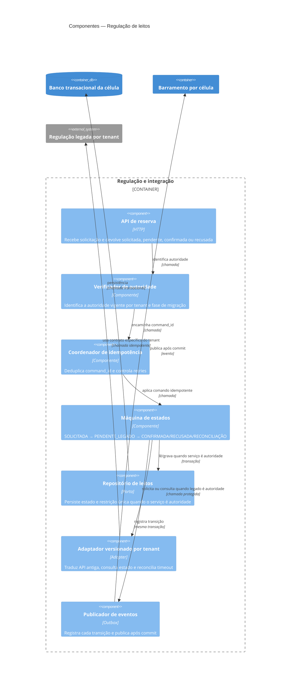

# C4 — Componentes da regulação

```mermaid
C4Component
  title Componentes — Regulação de leitos
  Container_Boundary(reg, "Regulação e integração") {
    Component(api, "API de reserva", "HTTP", "Recebe solicitação e devolve solicitada, pendente, confirmada ou recusada")
    Component(auth, "Verificador de autoridade", "Componente", "Identifica a autoridade vigente por tenant e fase de migração")
    Component(idempotency, "Coordenador de idempotência", "Componente", "Deduplica command_id e controla retries")
    Component(state, "Máquina de estados", "Componente", "SOLICITADA → PENDENTE_LEGADO → CONFIRMADA/RECUSADA/RECONCILIAÇÃO")
    Component(repo, "Repositório de leitos", "Porta", "Persiste estado e restrição única quando o serviço é autoridade")
    Component(legacyAdapter, "Adaptador versionado por tenant", "Adapter", "Traduz API antiga, consulta estado e reconcilia timeout")
    Component(outbox, "Publicador de eventos", "Outbox", "Registra cada transição e publica após commit")
  }
  ContainerDb(db, "Banco transacional da célula")
  Container(bus, "Barramento por célula")
  System_Ext(legacy, "Regulação legada por tenant")
  Rel(api, auth, "identifica autoridade", "chamada")
  Rel(auth, idempotency, "encaminha command_id", "chamada")
  Rel(idempotency, state, "aplica comando idempotente", "chamada")
  Rel(state, repo, "lê/grava quando serviço é autoridade", "transação")
  Rel(repo, db, "persistência", "chamada transacional")
  Rel(state, legacyAdapter, "solicita ou consulta quando legado é autoridade", "chamada protegida")
  Rel(legacyAdapter, legacy, "usa contrato específico do tenant", "chamada idempotente")
  Rel(state, outbox, "registra transição", "mesma transação")
  Rel(outbox, bus, "publica após commit", "evento")
```

[Imagem fornecida no pacote](c4-componentes.png) · [Fonte Mermaid](c4-componentes.mmd) · [Voltar ao índice](README.md)
