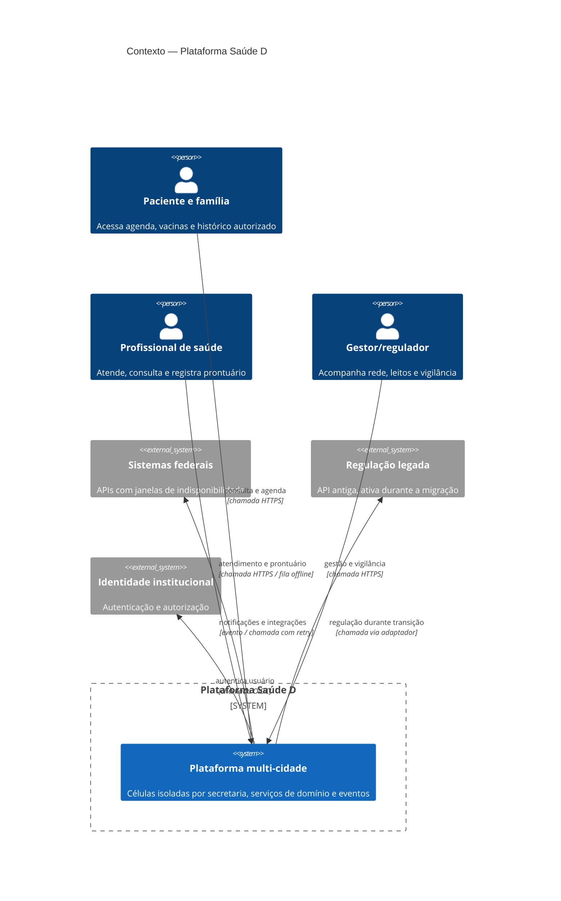

# C4 — Contexto

```mermaid
C4Context
  title Contexto — Plataforma Saúde D
  Person(patient, "Paciente e família", "Acessa agenda, vacinas e histórico autorizado")
  Person(clinician, "Profissional de saúde", "Atende, consulta e registra prontuário")
  Person(manager, "Gestor/regulador", "Acompanha rede, leitos e vigilância")
  System_Boundary(platform, "Plataforma Saúde D") {
    System(cells, "Plataforma multi-cidade", "Células isoladas por secretaria, serviços de domínio e eventos")
  }
  System_Ext(federal, "Sistemas federais", "APIs com janelas de indisponibilidade")
  System_Ext(legacy, "Regulação legada", "API antiga, ativa durante a migração")
  System_Ext(identity, "Identidade institucional", "Autenticação e autorização")
  Rel(patient, cells, "consulta e agenda", "chamada HTTPS")
  Rel(clinician, cells, "atendimento e prontuário", "chamada HTTPS / fila offline")
  Rel(manager, cells, "gestão e vigilância", "chamada HTTPS")
  Rel(cells, federal, "notificações e integrações", "evento / chamada com retry")
  Rel(cells, legacy, "regulação durante transição", "chamada via adaptador")
  Rel(cells, identity, "autentica usuário", "chamada OIDC")
```

[Imagem fornecida no pacote](c4-contexto.png) · [Fonte Mermaid](c4-contexto.mmd) · [Voltar ao índice](README.md)
